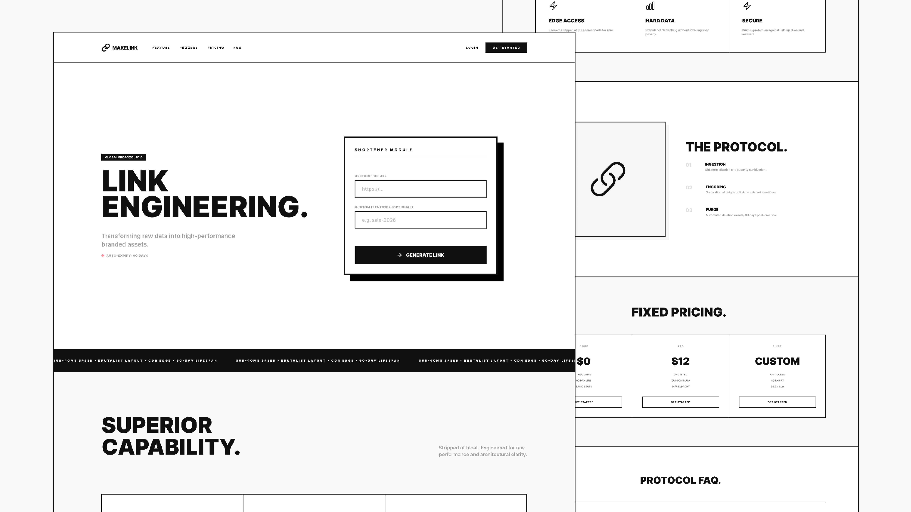

# URL Shortner - MakeLink



**MakeLink** is a high-performance, professional-grade URL shortener built with the MERN stack. Designed with a **Modernist Brutalist** aesthetic, it focuses on raw engineering, architectural clarity, and lightning-fast execution. It transforms messy raw data into sleek, branded assets for the modern web.

---

## 🚀 Live Preview

- **[Live Preview](https://make-link.vercel.app/)**
  <br>Experience MakeLink in action.

## 🎨 Figma UI Inspiration

- **[Figma Design File](https://www.figma.com/community/file/1371040846150181225/makelink-brutalist-ui-kit-design-system-url-shortner)**
  <br>Experience MakeLink in figma.
  
---

## ✨ Features

- **Sub-40ms Redirection**: Engineered for zero-latency user experience using Edge proxying via Vercel Rewrites.
- **Custom Identifiers**: Full support for branded slugs and personalized aliases.
- **Auto-Protocol**: Intelligent normalization and security sanitization of destination URLs.
- **Security Hardened**: Built-in protection via Helmet, Rate-Limiting, and forbidden protocol filtering.
- **90-Day Lifespan**: Automatic database auto-purge via MongoDB TTL (Time-To-Live) indexing.
- **Modernist Brutalist UI**: High-contrast neutral-scale interface optimized for focus, functional speed, and responsiveness.
- **Advanced SEO**: Fully implemented JSON-LD structured data, OpenGraph, and Twitter Card metadata.

---

## 🛠️ Technologies Used

- **Frontend**: React (Vite), Tailwind CSS v4, Framer Motion
- **Backend**: Node.js, Express.js, Mongoose
- **Database**: MongoDB Atlas
- **DevOps**: Vercel (Edge Proxying), Render (API Deployment)

---

## 🔑 Environment Variables

To run this project locally, create the following files:

### Server Environment (`/server/.env`)

```text
PORT=5000
MONGO_URI=your_mongodb_atlas_uri
BASE_URL=http://localhost:5000
```

### Client Environment (`/client/.env.local`)

```text
VITE_API_URL=http://localhost:5000/api
```

---

## ⚡ Installation & Usage

To get a local copy up and running, follow these steps:

1. **Clone the repository:**

   ```bash
   git clone https://github.com/saad-shaikh-256/URL-Shortner.git
   ```

2. **Navigate to the root folder:**

   ```bash
   cd URL-Shortner
   ```

3. **Install dependencies:**

   ```bash
   npm run install-all
   ```

4. **Start the development server:**

   ```bash
   npm run dev
   ```

5. **Open your browser and visit** [http://localhost:5173](http://localhost:5173) _(or the port shown in your terminal)_.

---

## 📝 Notes

- **Automatic Deletion**: This project uses a TTL index on MongoDB. All links are automatically deleted from the database exactly 90 days after creation.
- **Security Policy**: The system blocks `javascript`:, `data`:, and `file`: protocols to prevent XSS and session hijacking.
  Production Proxy: In production, the `vercel.json` handles rewrites so that users only see the `make-link.vercel.app`domain.

---

## 🚧 Future Enhancements

- Real-time click analytics dashboard
- QR Code generation for every shortened link
- Password-protected link redirects
- Custom domain mapping for enterprise users

---

## 🙌 Credits

- **Designed & Developed by [Saad Shaikh](https://saad-shaikh.vercel.app/)**

---

Feel free to suggest features, report bugs, or fork the project!

---

## ⚠️ Limitation of Liability & Disclaimer

**Usage of this tool is at your own risk.**

The developer of MakeLink:

- Does **not** monitor, endorse, or verify the content of any shortened URLs.
- Is **not** liable for any damages, legal issues, or security threats (malware, phishing, etc.) arising from the use of redirected links.
- Explicitly disclaims all responsibility for user-generated content.
- Provides this software for **learning and demonstration purposes only**.

If you find an abusive link, please report it via the GitHub Issues tab.
